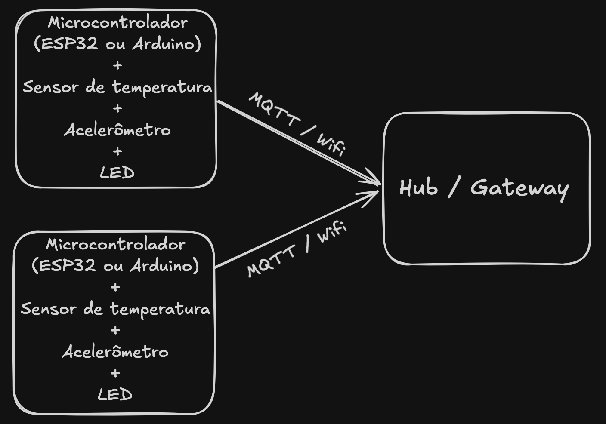

# Manutenção Preditiva de Ativos Industriais

**Sistemas Ubíquos — Atividade 01** | Integrantes: Guilherme Iago, João Victor Lemes, Marcos Sousa, Yasmin Moura

**Cenário:** monitoramento de vibração e temperatura em máquinas rotativas por nós sem fio, com decisão em um hub local e visualização em interface web (inspirado na Tractian).

## Parte 1 — Compreensão do problema

**1. Problema e usuários.** A manutenção industrial é corretiva (após a quebra, com parada não planejada) ou preventiva por calendário (descarta peças ainda boas). Falhas como desgaste de rolamento e desalinhamento aparecem semanas antes na vibração e na temperatura, mas só são vistas em rondas manuais esporádicas. Usuários: técnico de manutenção (o que inspecionar agora), planejador/PCM (quando programar a parada) e gestor (risco de parada). Uso em chão de fábrica: ruído, calor, interferência de inversores e sem tomada junto ao ponto de medição.

**2. Contexto.** Do ativo: vibração triaxial, temperatura da carcaça, ligado/desligado e regime de carga. Do ambiente: temperatura ambiente (interessa o *delta*, não o valor absoluto) e turno. Do usuário: papel e proximidade do ativo. Do sistema: bateria, qualidade do enlace e última comunicação de cada nó.

**3. Dispositivos e comunicação.** Nó sensor (microcontrolador com Wi-Fi, acelerômetro MEMS, sensores de temperatura, LED RGB, alimentação) fixado na máquina; hub local alimentado pela rede; nuvem com interface web. O enlace nó→hub é **Wi-Fi**, usando a infraestrutura já existente na planta e dispensando um rádio proprietário — a comunicação é bidirecional, por MQTT sobre TLS, para que o hub devolva estado do LED e novos limiares. Optou-se por MQTT persistente em vez de HTTPS por requisição: uma única conexão e handshake TLS servem a todas as mensagens, evitando o custo de reconectar a cada envio. Hub→nuvem por MQTT/TLS e usuário por HTTPS. O nó envia apenas indicadores calculados — a forma de onda bruta só sob evento ou demanda.

**4. Processamento e resposta.** Na borda: RMS, pico, curtose e delta térmico. No hub (decisão principal): normalização pelo regime e pela temperatura ambiente, comparação com a linha de base do próprio ativo e análise de tendência. Na nuvem: histórico e notificações. Estados: normal (LED verde), atenção (LED amarelo + alerta com tendência), crítico (LED vermelho + notificação e sugestão de ordem de serviço) e sem comunicação/bateria baixa (LED azul).

**5. Risco principal.** Consumo de energia e dependência da infraestrutura de rede, consequência direta da escolha do Wi-Fi. Associação ao ponto de acesso e handshake TLS mantêm o rádio ativo por segundos a cada ciclo, contra dezenas de milissegundos de um rádio de baixo consumo — e o rádio é o maior gasto do nó. Some-se a isso a dependência da cobertura Wi-Fi no chão de fábrica, obstruído por estruturas metálicas e ruído de inversores. Mitigações: conexão MQTT persistente (um handshake apenas), IP estático, processamento na borda para reduzir o volume enviado, amostragem adaptativa por evento, agrupamento de várias janelas por transmissão e alimentação por fonte local nos ativos que a permitem. Complementam: *store-and-forward*, silêncio tratado como alarme e hub decidindo sem internet. Riscos secundários: falso positivo (corrói a confiança), segurança e privacidade dos dados de produção.

## Parte 2 — Modelagem

**6. Sensores, atuadores e gateway.** Acelerômetro: fonte primária do diagnóstico. Temperatura de carcaça: confirma atrito e falta de lubrificação; temperatura ambiente: contextualiza. Atuadores: LED no próprio ativo (informação visível sem dispositivo em mãos), alerta web e ordem de serviço. Gateway: concentra os nós pela rede Wi-Fi (broker MQTT local), processa, decide, mantém buffer e atua como fronteira de segurança entre a rede de campo e a corporativa.

**7. Fluxo.** O desgaste altera vibração e temperatura → o nó amostra periodicamente → calcula os indicadores na borda e descarta o sinal bruto → transmite por Wi-Fi/MQTT ao hub, que autentica e enfileira → o hub normaliza, compara com a linha de base e avalia tendência → classifica o estado do ativo → responde acendendo o LED na máquina e publicando o alerta na interface web → o técnico inspeciona e o PCM programa a intervenção → o resultado é registrado e reajusta a linha de base, fechando o laço.

**8. Classificação.** É *rede de sensores* na camada de campo (nós autônomos a bateria reportando a um coletor); é *IoT* na arquitetura (gateway, nuvem, aplicação web); é *sistema ciber-físico* pelo laço fechado entre estado mecânico, decisão e atuação; e é *ubíquo* porque a tecnologia desaparece no ambiente — o técnico olha para a máquina, não para um computador.

**9. Contexto e adaptação.** Máquina desligada: suspende o diagnóstico e reduz a amostragem. Indicador perto do limiar: ciclo passa de 10 min para 1 min e envia o espectro. Sinal Wi-Fi fraco ou ponto de acesso indisponível: o nó reduz tentativas de reconexão, acumula leituras em buffer local e reenvia ao restabelecer; o hub segue decidindo e, após o timeout, marca o ativo como "sem comunicação". Energia escassa ou nó a bateria: degradação graciosa — intervalos maiores, agrupamento de envios e desativação da análise espectral local. Mudança de regime ou de temperatura ambiente: troca de linha de base e avaliação por delta. Papel do usuário: LED em campo, tendência para o PCM, indicadores agregados para o gestor.
