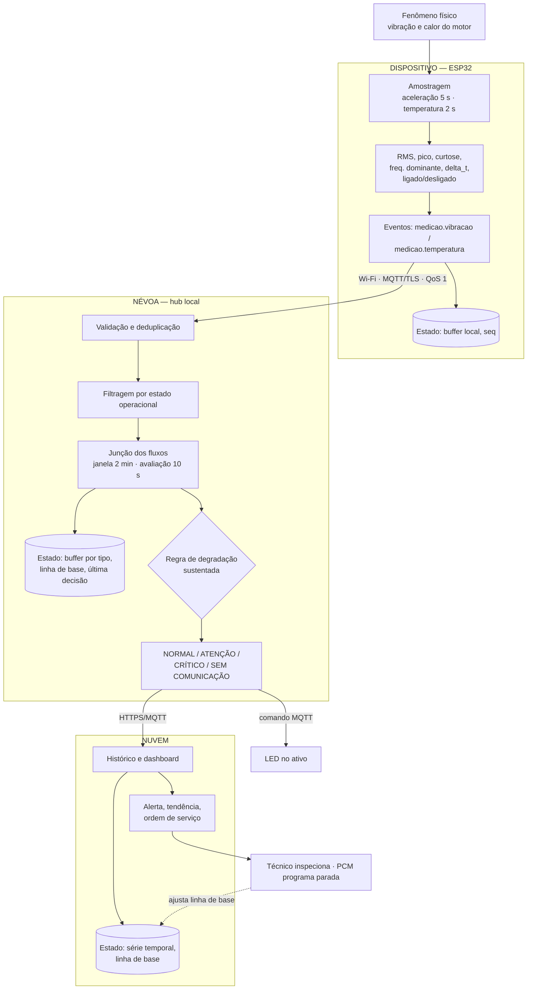

# Atividade 02 — Processamento e Distribuição de Responsabilidades

**Sistemas Ubíquos — Atividade 02** | Integrantes: Guilherme Iago, João Victor Lemes, Marcos Sousa, Yasmin Moura

**Cenário:** manutenção preditiva de máquinas rotativas. Nós ESP32 com acelerômetro triaxial e sensores de temperatura enviam indicadores por Wi-Fi/MQTT a um hub local, que decide sobre a necessidade de manutenção e responde por LED no ativo e por interface web.

## Parte 1 — Eventos

**1. Tipos de evento.** Mesmo produtor, ocorrências de naturezas distintas:
- **`medicao.vibracao`** — janela de aceleração em alta taxa. Fenômeno rápido e impulsivo (desbalanceamento, desalinhamento, defeito de rolamento).
- **`medicao.temperatura`** — carcaça e ambiente. Fenômeno lento, de inércia térmica (atrito, falta de lubrificação, sobrecarga).

Dinâmicas, custos de aquisição e cadências diferentes justificam a separação. Um terceiro evento auxiliar, `maquina.mudanca_operacao` (`LIGADA`/`DESLIGADA`, derivado do nível de vibração), é emitido por exceção e valida o contexto da regra — nenhum diagnóstico vale sobre máquina parada.

**2. Contrato.**

| Campo | `medicao.vibracao` | `medicao.temperatura` |
|---|---|---|
| Produtor / Entidade | `node_id` / `asset_id` | `node_id` / `asset_id` |
| Tempo do evento | `ts_evento` (ISO-8601 UTC, NTP) | `ts_evento` |
| Identificação | `event_id` (UUID) + `seq` (monotônico por nó) | `event_id` + `seq` |
| Cadência (protótipo / produção) | 5 s / 10 min | 2 s / 1 min |
| Campos | `rms_x/y/z`, `rms_resultante`, `pico` (g), `curtose`, `freq_dominante` (Hz) | `temp_carcaca`, `temp_ambiente`, `delta_t` (°C) |
| Comuns | `tensao` (V), `rssi` (dBm) | `tensao` (V), `rssi` (dBm) |

**3. Exemplos.**

```json
{ "tipo": "medicao.vibracao", "event_id": "8f1c...a2", "seq": 14872,
  "node_id": "esp32-07", "asset_id": "motor-linha3-02",
  "ts_evento": "2026-08-28T13:40:00Z",
  "rms_x": 2.81, "rms_y": 1.02, "rms_z": 0.95, "rms_resultante": 3.16,
  "pico": 7.4, "curtose": 4.1, "freq_dominante": 29.6, "tensao": 4.02, "rssi": -71 }
```
```json
{ "tipo": "medicao.temperatura", "event_id": "3ba7...9c", "seq": 14873,
  "node_id": "esp32-07", "asset_id": "motor-linha3-02",
  "ts_evento": "2026-08-28T13:40:02Z",
  "temp_carcaca": 68.2, "temp_ambiente": 31.0, "delta_t": 37.2,
  "tensao": 4.02, "rssi": -70 }
```

**4. Qualidade.** Validação de **faixa física e coerência entre campos**: `rms_resultante` 0,01–50 g, `pico ≥ rms_resultante`, `curtose` 1,5–50; `temp_carcaca` −10–150 °C, `temp_ambiente < temp_carcaca + 5`, variação máxima de 5 °C/min (a inércia térmica torna um salto maior impossível ⇒ sensor solto). Assim:
- **inválido:** campo fora de faixa, saturação de fundo de escala ou valor repetido bit a bit (sensor travado) → descartado e contado como falha do nó;
- **duplicado:** par `(node_id, seq)` já processado, efeito normal do reenvio MQTT QoS 1 → descartado por idempotência;
- **desatualizado:** `ts_evento` anterior à marca d'água → questão 8.

## Parte 2 — Processamento temporal

**5. Operações.** `Ingestão (MQTT) → Validação → Deduplicação por (node_id, seq) → Filtragem (descarta ativo DESLIGADO) → Transformação (normaliza RMS pela linha de base do regime dado por freq_dominante; consolida delta_t) → Agrupamento por asset_id → Junção dos dois fluxos na janela → Agregação (mediana do RMS normalizado, máximo da curtose, média do delta_t) → Detecção → Atuação (LED + alerta)`.

**6. Estado e janela.** Regra de **degradação sustentada** sobre janela deslizante, aplicada aos dois fluxos. Estado por ativo: buffer de medições válidas por tipo, linha de base de RMS por regime e de `delta_t`, estado operacional e instante da última transição, última decisão e maior `seq`. A regra exige eventos anteriores porque uma leitura alta isolada pode ser transiente de partida ou impacto na estrutura — exige-se persistência.

Parâmetros configuráveis; a lógica é a mesma nos dois perfis:

| Parâmetro | Protótipo | Produção |
|---|---|---|
| Janela / avaliação | 2 min / 10 s | 30 min / 5 min |
| Tolerância de atraso | 20 s | 10 min |
| Mínimo de amostras válidas | 12 vib / 30 temp | 2 vib / 20 temp |

O perfil de bancada foi adotado por **validade estatística** (na cadência de produção a janela teria ~3 amostras de vibração, mediana pouco significativa; a 5 s reúne 24) e **observabilidade** (o desbalanceamento induzido reflete no LED em dezenas de segundos, demonstrando o laço completo). É viável porque o nó de bancada é alimentado por USB.

**7. Semântica temporal.** Usa-se o **tempo do evento**. Sob Wi-Fi industrial, um lote retido no buffer durante queda de sinal chega em rajada; pelo tempo de processamento essas amostras cairiam na mesma janela, criando tendência inexistente. Com dois fluxos de cadências distintas o erro seria maior ainda, pois vibração e temperatura de instantes físicos diferentes seriam correlacionadas. O tempo de processamento serve apenas para detectar nó silencioso e medir latência.

**8. Eventos atrasados.** **Marca d'água** com a tolerância da questão 6. Dentro dela, o evento é **aceito e a janela recomputada**; mudando o resultado, publica-se retificação com o mesmo `window_id` (decisão idempotente e versionada). Passada a tolerância, o evento é **separado**: não altera a decisão emitida, mas é gravado na nuvem como `atrasado` e continua útil para tendência de longo prazo e reajuste da linha de base. Nada é descartado em silêncio.

**9. Pseudocódigo.**

```
PASSO = 10s (prod. 5min)   JANELA = 2min (prod. 30min)
MIN_VIB = 12 (prod. 2)     MIN_TEMP = 30 (prod. 20)

a cada PASSO, para cada asset:
    janela ← eventos com ts_evento em [agora − JANELA, agora]

    # validade — cada fluxo tem seu mínimo
    vib  ← janela.filtrar(e → e.tipo="medicao.vibracao"   e valido(e) e não_duplicado(e))
    temp ← janela.filtrar(e → e.tipo="medicao.temperatura" e valido(e) e não_duplicado(e))
    se contar(vib) < MIN_VIB ou contar(temp) < MIN_TEMP então
        publicar(asset, "DADOS_INSUFICIENTES"); continuar

    # contexto operacional
    se asset.estado = "DESLIGADA" ou houve_transicao(asset, janela) então
        publicar(asset, "NAO_AVALIAVEL"); continuar

    # agregação
    base        ← asset.baseline[regime(vib.freq_dominante)]
    rms_norm    ← mediana(vib.rms_resultante) / base.rms
    curtose_max ← maximo(vib.curtose)
    delta_t     ← media(temp.delta_t)
    excedentes  ← contar(vib onde rms_resultante > 1.5 × base.rms)

    # condição: evidência mecânica + confirmação
    se rms_norm ≥ 2.0 e (curtose_max ≥ 6.0 ou delta_t ≥ base.delta_t + 20) então
        decisao ← "CRITICO"
    senão se excedentes ≥ 0.8 × contar(vib) ou delta_t ≥ base.delta_t + 10 então
        decisao ← "ATENCAO"
    senão
        decisao ← "NORMAL"

    se decisao ≠ asset.ultima_decisao então
        comandar_led(asset, cor(decisao))
        publicar_alerta(asset, decisao, rms_norm, curtose_max, delta_t, window_id)
        asset.ultima_decisao ← decisao
```

## Parte 3 — Distribuição e resiliência

**10. Distribuição.**

| Responsabilidade | Local | Estado mantido |
|---|---|---|
| Amostragem dos dois fluxos, cálculo dos indicadores, detecção ligado/desligado, geração de eventos | **Dispositivo** (ESP32) | Buffer de eventos não confirmados, `seq`, estado do LED |
| Validação, deduplicação, junção, janela, linha de base, decisão, comando do LED | **Névoa** (hub local) | Buffer da janela por tipo, linha de base por regime, estado operacional, última decisão |
| Histórico, dashboard, notificações, reajuste da linha de base | **Nuvem** | Série temporal, ordens de serviço, usuários |

Não há camada de borda separada: o próprio nó faz o pré-processamento, e criar um nível extra apenas para preencher o contínuo não atenderia nenhuma necessidade real.

**11. Justificativas.**
- **Decisão na névoa, não na nuvem — latência e conectividade.** O LED é consumido pelo técnico durante a ronda e deve refletir o estado em segundos; na nuvem, o diagnóstico dependeria do link de internet da planta, o elo menos confiável. No hub, a decisão persiste mesmo offline.
- **Indicadores extraídos no dispositivo — volume de dados e energia.** Amostrar 3,2 kHz em três eixos gera ~1,4 MB/min por nó; transmitir isso saturaria a rede e manteria o rádio sempre ativo, maior consumidor do nó. Eventos de centenas de bytes reduzem o tráfego em três ordens de grandeza — e é o que torna a cadência do protótipo viável, mantendo o gargalo fora da rede.
- **Cadência como parâmetro, não constante.** O limite é energia, não o broker: conexão persistente custa ~20–30 mA (poucos dias de bateria) contra ~0,5 mA em *deep sleep* (meses). Como reassociar ao AP custa segundos de rádio, não há meio-termo abaixo de ~1 min por evento. Bancada com USB privilegia observabilidade; campo com bateria privilegia autonomia; a lógica não muda.

**12. Falhas.** **Nó silencioso por indisponibilidade do Wi-Fi:** o nó segue amostrando em buffer circular local (~6 h), reconecta com recuo exponencial e mantém o LED na última decisão. O hub, sem eventos por mais de três cadências esperadas, não lê o silêncio como normalidade: marca `SEM_COMUNICACAO`, congela a decisão em vez de recalcular sobre janela vazia e alerta a infraestrutura. Restabelecido o enlace, o buffer é reenviado, a deduplicação por `(node_id, seq)` evita reprocessamento e as janelas são recomputadas pelo tempo do evento (questão 8). Se apenas um fluxo falhar — sensor térmico mudo —, o sistema **degrada parcialmente**: mantém a avaliação por vibração e suprime só os critérios térmicos. Perde-se atualidade ou cobertura, nunca a integridade histórica nem a visibilidade da falha.

**13. Diagrama.**


